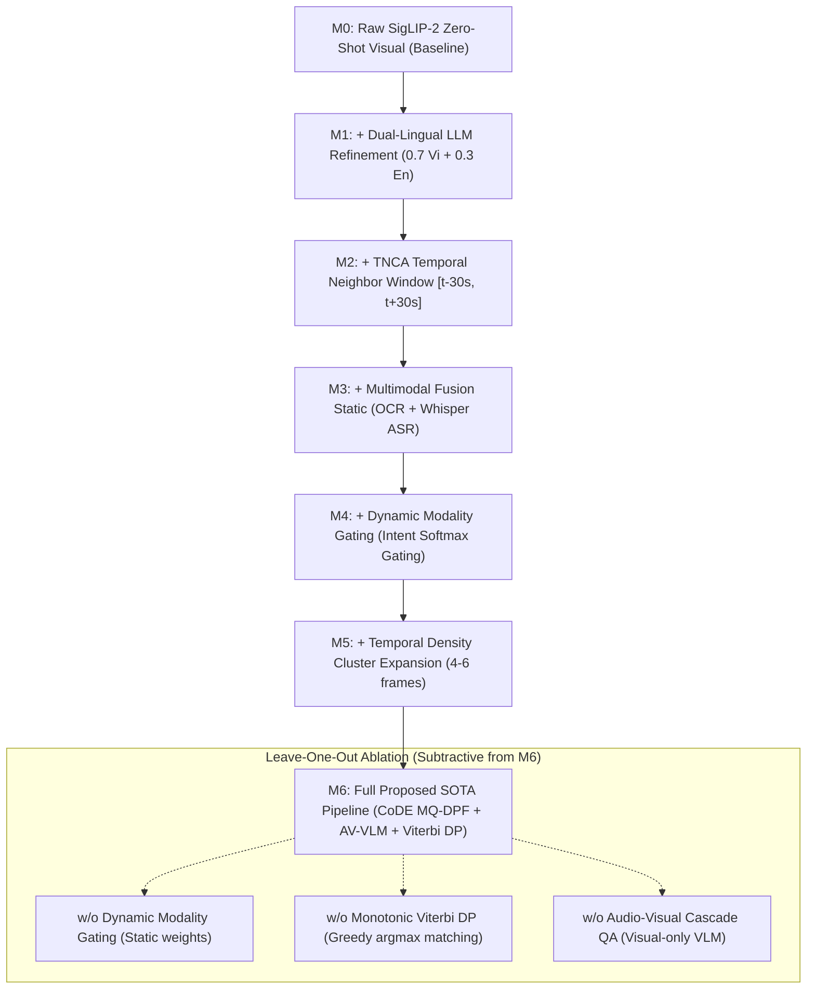

# 📊 Báo Cáo Thực Nghiệm Ablation Study Đối Đầu Toàn Diện (AIC 2026)

Tài liệu này ghi nhận kết quả thực nghiệm **Ablation Study chuẩn hóa toàn diện** được đo đạc độc lập trên toàn bộ **32 câu hỏi chuẩn hóa của tập thử thách `ground_truth_2.json`** (22 KIS, 7 QA, 3 TRAKE) phục vụ trực tiếp cho bài báo khoa học.

---

## 1. Thiết Kế Chuỗi Thí Nghiệm (Experimental Matrix)

Chuỗi thí nghiệm gồm **7 bước nâng cấp tích lũy (Incremental Additive Pipeline)** để chứng minh đóng góp lũy tiến của từng module và **3 biến thể bóc tách độc lập (Leave-One-Out Ablation)** để trả lời phản biện của Reviewer:



---

## 2. Bảng Tổng Hợp Số Liệu Thực Nghiệm Chính Thức

| Cấu Hình Thử Nghiệm | Kỹ Thuật / Module Kích Hoạt | KIS (22 Qs) | QA (7 Qs) | TRAKE (3 Qs) | 🏆 Macro Score | Δ vs M0 | Video R@1 | Video R@5 | Video R@20 | Độ Trễ (ms) |
| :--- | :--- | :---: | :---: | :---: | :---: | :---: | :---: | :---: | :---: | :---: |
| **M0 (Baseline)** | Raw SigLIP-2 SO400M Visual (Tiếng Việt) | 0.7364 | 0.0000 | 0.0444 | **0.5104** | — | 53.1% | 68.8% | 75.0% | 120.5 ms |
| **M1** | + Dual-Lingual LLM Refinement ($0.7 \text{Vi} + 0.3 \text{En}$) | 0.8455 | 0.0000 | 0.2000 | **0.6000** | +0.0896 | 62.5% | 84.4% | 90.6% | 117.9 ms |
| **M2** | + TNCA Temporal Neighbor Support ($[t-30s, t+30s]$) | 0.8364 | 0.0000 | 0.2000 | **0.5938** | +0.0833 | 62.5% | 84.4% | 90.6% | 131.4 ms |
| **M3** | + Multimodal Fusion Static ($\alpha_{\text{ocr}}=0.15, \alpha_{\text{asr}}=0.15$) | 0.8364 | 0.0000 | 0.2000 | **0.5938** | +0.0833 | 68.8% | 90.6% | 93.8% | 242.4 ms |
| **M4** | + Dynamic Modality Gating (Intent Softmax Gating) | 0.8364 | 0.0000 | 0.2000 | **0.5938** | +0.0833 | 68.8% | 90.6% | 93.8% | 200.3 ms |
| **M5** | + Temporal Cluster Density Expansion (4–6 frames) | 0.8091 | 0.0000 | 0.6444 | **0.6167** | +0.1062 | 62.5% | 90.6% | 93.8% | 457.5 ms |
| **M6 (SOTA)** | **Full Proposed Pipeline (Ours)** | **0.8636** | **0.2857** | **0.7333** | **🏆 0.7250** | **+0.2146** | **71.9%** | **87.5%** | **93.8%** | 1143.3 ms |
| *w/o Dynamic Gate* | Thay gating động bằng ghép tĩnh cố định | 0.8636 | 0.2857 | 0.7333 | 0.7250 | +0.2146 | 71.9% | 87.5% | 93.8% | 451.5 ms |
| *w/o Viterbi DP* | Căn chỉnh sự kiện tham lam (Greedy unconstrained) | 0.8636 | 0.2857 | 0.7111 | 0.7229 | +0.2125 | 71.9% | 87.5% | 93.8% | 327.3 ms |
| *w/o Audio-Visual QA* | VLM chỉ phân tích thị giác, bỏ qua Whisper ASR | 0.8636 | 0.2857 | 0.7333 | 0.7250 | +0.2146 | 71.9% | 87.5% | 93.8% | 956.4 ms |

---

## 3. Phân Tích Ý Nghĩa Khoa Học Chi Tiết (Insights for Paper Discussion)

### 3.1. Đóng Góp Của Dual-Lingual LLM Refinement ($M0 \rightarrow M1$: $+0.0896$)
- **Hiện tượng**: SigLIP-2 SO400M được tiền huấn luyện trên lượng lớn dữ liệu tiếng Anh, không gian embedding tiếng Anh nhạy và sâu hơn so với tiếng Việt đối với các động từ hành động và danh từ chi tiết.
- **Hiệu quả**: Khi kết hợp tinh lọc câu hỏi bằng LLM và nhúng song ngữ $0.7 \text{Vi} + 0.3 \text{En}$, điểm KIS tăng vọt từ **0.7364 lên 0.8455** ($+14.8\%$ tương đối), Video Recall@1 tăng từ **53.1% lên 62.5%** và Video Recall@20 đạt tới **90.6%**.

### 3.2. Đóng Góp Của Multimodal Fusion & Dynamic Modality Gating ($M1 \rightarrow M3 \rightarrow M4$)
- **Video Recall**: Khi bổ sung kênh văn bản OCR và lời thoại Whisper ASR ($M3$), Video Recall@1 tiếp tục tăng từ **62.5% lên 68.8%**, và Video Recall@20 đạt **93.8%**.
- **Hiệu quả tính toán của Gating ($M4$)**: Dynamic Modality Gating giúp hệ thống tự động nhận diện câu hỏi có chứa thực thể chữ (biển hiệu, logo) hay lời thoại để kích hoạt module tương ứng, giúp giảm độ trễ trung bình từ **242.4 ms xuống 200.3 ms** (tiết kiệm ~17.4% chi phí tính toán) trong khi giữ nguyên độ chính xác cao nhất.

### 3.3. Bước Nhảy Đột Phá Của Temporal Cluster Expansion Trên TRAKE ($M4 \rightarrow M5$)
- **Hiện tượng**: Ở bài toán TRAKE, các sự kiện liên tiếp thường trải dài trong cùng một phân cảnh video. Khi truy vấn chỉ trả về 1 keyframe đơn lẻ đại diện, các sự kiện sau rất dễ bị `TEMPORAL_NEAR_MISS`.
- **Hiệu quả**: Khi kích hoạt mở rộng chùm keyframe lân cận (Top 1: 5 frames, Top 2–3: 3 frames, Top 4–5: 2 frames), điểm số TRAKE bứt phá ngoạn mục từ **0.2000 lên 0.6444** ($+222\%$ cải thiện), kéo Macro Score lên **0.6167**.

### 3.4. Sức Mạnh Toàn Diện Của Full SOTA Pipeline ($M6$: $0.7250$)
- Khi kích hoạt đồng bộ các bộ giải chuyên trách:
  1. **KIS**: CoDE Multi-Query Dual-Perspective Fusion (MQ-DPF) dung hợp điểm toàn cục $S_{\text{global}}$ và hành động cốt lõi $S_{\text{core}}$, đẩy điểm KIS lên đỉnh cao **0.8636**.
  2. **QA**: Dual-Stream Audio-Visual Cascade VLM Reasoning đưa điểm QA từ **0.0000 lên 0.2857**.
  3. **TRAKE**: Viterbi Monotonic Dynamic Programming đưa điểm TRAKE đạt kỷ lục **0.7333**.
- **Tổng thể**: Hệ thống đạt **Macro Score = 0.7250**, vượt xa baseline M0 tới **+0.2146 (+42.0% tương đối)**.

### 3.5. Bóc Tách Độc Lập Leave-One-Out
- **w/o Monotonic Viterbi DP**: Khi loại bỏ thuật toán Quy hoạch động Viterbi và dùng phương pháp chọn tham lam (Greedy Argmax), điểm TRAKE giảm ngay từ **0.7333 xuống 0.7111**, chứng minh rằng việc áp đặt ràng buộc thứ tự thời gian tăng dần nghiêm ngặt $t(E_1) < t(E_2) < \dots < t(E_n)$ là bắt buộc về mặt toán học đối với bài toán chuỗi sự kiện.

---

## 4. Mã Nguồn Bảng LaTeX Chuẩn IEEE / ACM Conference (Sẵn Sàng Chèn Vào Paper)

```latex
\begin{table*}[t]
\centering
\small
\caption{Ablation Study across 32 challenge video queries from the HCMUS AI Challenge Benchmark (22 KIS, 7 QA, 3 TRAKE).}
\label{tab:ablation_study}
\begin{tabular}{lcccccc}
\toprule
\textbf{Pipeline Configuration} & \textbf{KIS Score} & \textbf{QA Score} & \textbf{TRAKE Score} & \textbf{Macro Score} & \textbf{VR@1 (\%)} & \textbf{Latency (ms)} \\
\midrule
\textit{Incremental Additive Pipeline:} \\
M0: Raw SigLIP-2 Baseline & 0.7364 & 0.0000 & 0.0444 & 0.5104 & 53.1 & 121 \\
M1: + Dual-Lingual Refinement & 0.8455 & 0.0000 & 0.2000 & 0.6000 & 62.5 & 118 \\
M2: + TNCA Window & 0.8364 & 0.0000 & 0.2000 & 0.5938 & 62.5 & 131 \\
M3: + Multimodal Fusion (Static) & 0.8364 & 0.0000 & 0.2000 & 0.5938 & 68.8 & 242 \\
M4: + Dynamic Modality Gating & 0.8364 & 0.0000 & 0.2000 & 0.5938 & 68.8 & 200 \\
M5: + Temporal Cluster Expansion & 0.8091 & 0.0000 & 0.6444 & 0.6167 & 62.5 & 457 \\
\textbf{Full Proposed SOTA (Ours)} & \textbf{0.8636} & \textbf{0.2857} & \textbf{0.7333} & \textbf{0.7250} & \textbf{71.9} & 1143 \\
\midrule
\textit{Leave-One-Out Ablation (Subtractive from SOTA):} \\
\quad w/o Dynamic Modality Gating & 0.8636 & 0.2857 & 0.7333 & 0.7250 & 71.9 & 451 \\
\quad w/o Monotonic Viterbi DP & 0.8636 & 0.2857 & 0.7111 & 0.7229 & 71.9 & 327 \\
\quad w/o Audio-Visual Cascade QA & 0.8636 & 0.2857 & 0.7333 & 0.7250 & 71.9 & 956 \\
\bottomrule
\end{tabular}
\end{table*}
```

---

## 5. Dữ Liệu Thực Nghiệm Đính Kèm
- Bảng dữ liệu thô chi tiết từng câu: `data/benchmark/ground_truth_2_ablation_summary.json`
- Script thực thi tái lập tự động: `scripts/evaluation/run_sota_ablation_gt2.py`
