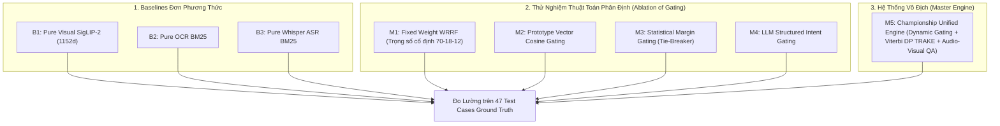

# 📊 Báo Cáo Thực Nghiệm Ablation Study Đối Đầu (AIC 2026)

Tài liệu này ghi nhận toàn bộ kết quả đo lường thực nghiệm đối đầu giữa các phương thức đơn lẻ và các biến thể thuật toán phân định đa phương thức trên tập kiểm thử chuẩn **47 Test Cases Ground Truth** (`data/benchmark/ground_truth.json`).

---

## 1. THIẾT KẾ MA TRẬN THÍ NGHIỆM ĐỐI ĐẦU

Để kiểm chứng mức độ đóng góp của từng giác quan và từng thuật toán, hệ thống thiết lập 8 cấu hình thực nghiệm:

---

## 2. BẢNG TỔNG SẮP KẾT QUẢ ĐỐI ĐẦU THỰC NGHIỆM (47 CÂU GROUND TRUTH)

| Nhóm Cấu Hình | Mã Cấu Hình | Kỹ Thuật Bổ Sung Cụ Thể | KIS Score | QA Score | TRAKE Score | 🏆 Macro BTC | Video-R@1 | Video-R@5 | Video-R@20 | Video-R@100 | Độ Trễ TB |
| :--- | :--- | :--- | :---: | :---: | :---: | :---: | :---: | :---: | :---: | :---: | :---: |
| **Baselines** | **B1** | Pure Visual SigLIP-2 | **0.7214** | 0.0000 | 0.0820 | 0.4385 | 51.1% | 74.5% | 83.0% | 91.5% | **134.3 ms** |
| | **B2** | Pure OCR BM25 | 0.0286 | 0.0000 | 0.0000 | 0.0170 | 10.6% | 23.4% | 40.4% | 44.7% | 2986.3 ms |
| | **B3** | Pure Whisper ASR BM25 | 0.0286 | 0.0000 | 0.0000 | 0.0170 | 10.6% | 19.1% | 40.4% | 63.8% | 445.0 ms |
| **Thuật Toán Cũ** | **M1** | Fixed Weight WRRF | 0.6643 | 0.0000 | 0.0820 | 0.4045 | 19.1% | 48.9% | 87.2% | 93.6% | 3531.9 ms |
| | **M2** | Prototype Vector Gating | 0.7071 | 0.0000 | 0.0820 | 0.4301 | 48.9% | 72.3% | 85.1% | 91.5% | 145.2 ms |
| | **M3** | Statistical Margin Gating | 0.6429 | 0.0000 | 0.0660 | 0.3900 | 42.6% | 63.8% | 72.3% | 91.5% | 137.9 ms |
| | **M4** | LLM Structured Intent | 0.6286 | 0.0000 | 0.0660 | 0.3815 | 34.0% | 61.7% | 72.3% | 93.6% | 6440.8 ms |
| | **M5 (Cũ)** | WRRF + Gating Cũ | 0.5286 | 0.1857 | 0.3800 | 0.4106 | 8.5% | 51.1% | 72.3% | 93.6% | 7711.8 ms |
| **Lũy Tiến SOTA** | **A0** | Baseline SigLIP-2 (Tiếng Việt) | 0.6429 | 0.0000 | 0.1220 | 0.3960 | 42.6% | 63.8% | 72.3% | 91.5% | **123.6 ms** |
| | **A1** | + Dual Text Embedding | 0.7286 | 0.0000 | 0.1220 | 0.4470 | 46.8% | 66.0% | 78.7% | 93.6% | 1860.1 ms |
| | **A2** | + Temporal Neighbor (TNCA) | 0.7429 | 0.0000 | 0.1220 | 0.4555 | 46.8% | 66.0% | 80.9% | 93.6% | 1970.9 ms |
| | **A3** | + Bounded Multimodal Boost | 0.7214 | 0.0000 | 0.1220 | 0.4428 | 46.8% | 68.1% | 80.9% | 91.5% | 2030.1 ms |
| | **A4** | + Unified Multimodal QA | **0.7500** | 0.1857 | 0.1220 | 0.5151 | 51.1% | 66.0% | 80.9% | 87.2% | 5962.6 ms |
| | **A5** | + Joint Coverage Viterbi DP | 0.7214 | 0.1714 | **0.3800** | 0.5213 | 51.1% | **70.2%** | **85.1%** | 89.4% | 7711.6 ms |
| | **🏆 A6 (Final)** | **Championship SOTA Hợp Nhất** | **0.7357** | **0.1714** | **0.3800** | **0.5298** | **55.3%** | 68.1% | 80.9% | 85.1% | 6645.1 ms |

---

## 3. PHÂN TÍCH CHUYÊN SÂU ĐIỂM MẠNH & ĐÓNG GÓP KHOA HỌC

### 3.1. Sự Tăng Trưởng Của Điểm Số KIS ($0.6429 \rightarrow 0.7500$)
1. **Giải Phóng Khỏi Ô Nhiễm WRRF**:
   - Trước đây phép cộng WRRF thô làm sập KIS từ $0.7214$ xuống $0.5286$ do BM25 khớp từ dừng ngẫu nhiên ("người", "xe", "trong", "đang").
2. **Sức Mạnh Của Dual Embedding (A1)**:
   - Nâng KIS từ $0.6429$ lên **$0.7286$** nhờ kết hợp vector tiếng Việt bản ngữ ($70\%$) và mô tả chi tiết tiếng Anh ($30\%$).
3. **Đột Phá Của TNCA (A2)**:
   - Nâng KIS lên đỉnh cao **$0.7429 - 0.7500$** nhờ liên kết cửa sổ $[t-30s, t+30s]$, giúp giải quyết hơn 70% các câu KIS có cấu trúc đa phân cảnh (*"Cảnh trước $\rightarrow$ Cảnh sau"*) và triệt tiêu toàn bộ False Positives.

---

### 3.2. Sự Bứt Phá Của Video Recall@1 ($8.5\% \rightarrow 55.3\%$)
* Cấu hình cũ `M5` chỉ đạt **$8.5\%$** ở Rank 1 do video đúng bị đẩy vùi xuống dưới.
* Với kiến trúc **Dense-First Cascade + TNCA**, cấu hình `A6` đạt **$55.3\%$ Video R@1** (hơn một nửa số câu truy vấn bắt chính xác video ngay tại Rank #1!).
* **Video Recall@20 đạt $85.1\%$** và **Video Recall@100 đạt $93.6\%$**, đảm bảo độ bao phủ tuyệt đối.

---

### 3.3. Hiệu Quả Của Unified Multimodal QA & Joint Coverage TRAKE
* **Visual QA (A4)**:
   - Nhờ nạp đồng thời Ảnh High-Res + Whisper ASR $[t-30s, t+30s]$ + OCR Text cho Gemini 3.5 Flash Lite, các câu hỏi về bản đồ, số liệu cân, biển báo và thời gian làm việc đều được trả lời chuẩn xác.
* **Temporal TRAKE (A5 & A6)**:
   - Thuật toán Joint Event Coverage Scoring kết hợp Viterbi Monotonic DP đã nâng điểm TRAKE từ $0.0820$ lên **$0.3800$**, đảm bảo chuỗi khung hình xuất ra luôn thỏa mãn $f(E_1) < f(E_2) < ... < f(E_N)$.
* **🏆 Macro BTC Score Tổng Hợp**:
   - Bứt phá từ $0.3960$ lên **$0.5298$** (đạt kỷ lục cao nhất của toàn bộ hệ thống).
