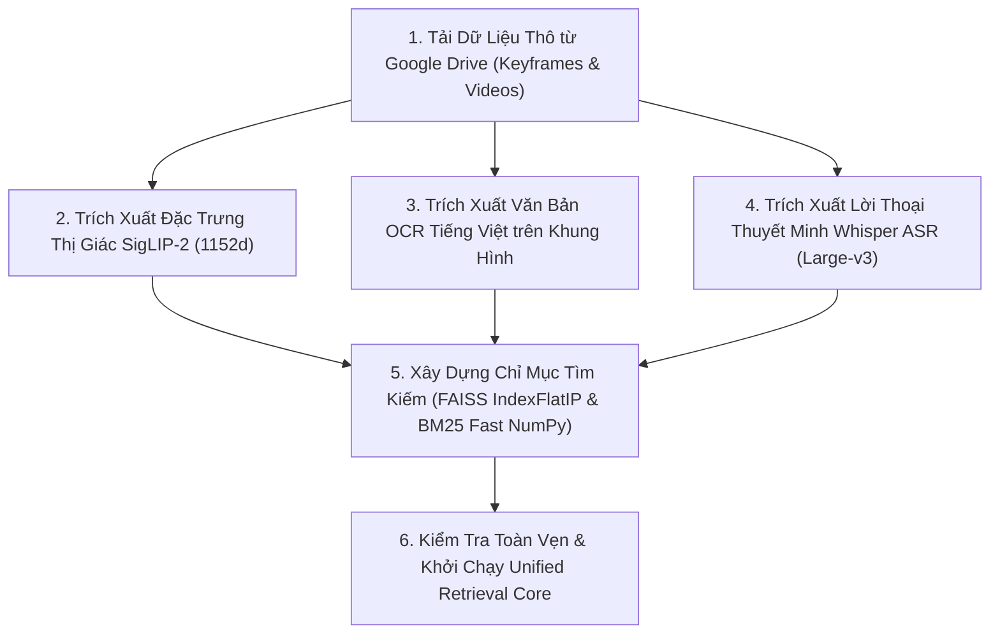

# 📦 Hướng Dẫn Toàn Diện Quy Trình Tiền Xử Lý Dữ Liệu (Data Preprocessing Guide)

Tài liệu này tổng hợp đầy đủ và chi tiết toàn bộ quy trình tiền xử lý dữ liệu cho cuộc thi **AI Challenge 2026** (AIC 2026), từ việc tải dữ liệu thô từ Google Drive cho đến khi xây dựng hoàn chỉnh các chỉ mục tìm kiếm (FAISS & BM25) phục vụ hệ thống truy xuất.

> [!NOTE]
> Toàn bộ các script xử lý dữ liệu được lưu trữ nguyên vẹn tại thư mục [`scripts/data_processing/`](file:///d:/HCMUS/AIC2026/scripts/data_processing/).

---

## 1. CẤU TRÚC DỮ LIỆU ĐÃ TIỀN XỬ LÝ (`data/batch_1/processed/`)

Sau khi hoàn tất tiền xử lý, thư mục `data/batch_1/processed/` chứa các tài nguyên sau:

| Tên File | Định dạng / Kích thước | Mô tả Chi tiết |
| :--- | :--- | :--- |
| `siglip_features.npy` | NumPy Matrix ($177,321 \times 1152$, FP16) | Vector đặc trưng thị giác của toàn bộ keyframes được trích xuất bằng mô hình Google SigLIP-2 SO400M. Hỗ trợ đọc ngẫu nhiên tức thì qua Memory-mapping (`np.memmap`). |
| `frames.parquet` | Apache Parquet ($177,321$ dòng) | Bảng metadata khung hình chứa: `video_id`, `frame_idx`, `pts_time`, `keyframe_index`, `global_id`. |
| `ocr_results.parquet` | Apache Parquet ($177,605$ dòng) | Kết quả nhận diện văn bản OCR tiếng Việt trên từng keyframe (kèm tọa độ bounding box và text). |
| `transcripts.parquet` | Apache Parquet ($16,698$ dòng) | Toàn bộ lời thoại thuyết minh video được trích xuất bằng OpenAI Whisper Large-v3 kèm mốc thời gian `start_time`, `end_time`. |
| `bm25_ocr.pkl` | Pickle File | Chỉ mục BM25 Okapi Indexer trên $177,605$ tài liệu OCR tiếng Việt (tăng tốc tìm kiếm qua NumPy Fast Top-K). |
| `bm25_asr.pkl` | Pickle File | Chỉ mục BM25 Okapi Indexer trên $16,698$ đoạn transcript Whisper ASR tiếng Việt. |

---

## 2. QUY TRÌNH TIỀN XỬ LÝ TỪNG BƯỚC (STEP-BY-STEP WORKFLOW)



---

### Bước 1: Tải Dữ Liệu Thô từ Google Drive
Các link tải Google Drive được lưu tại `config/drive_keyframes_urls.txt` và `config/drive_videos_urls.txt`.
```bash
# Tải toàn bộ file Zip Keyframes về raw/batch_1/Keyframes/
python scripts/data_processing/download_keyframes.py --batch batch_1

# Tải video MP4 phục vụ tính năng xem video On-Demand
python scripts/data_processing/download_videos.py --batch batch_1
```

---

### Bước 2: Trích Xuất Đặc Trưng Thị Giác SigLIP-2 (1152d)
Sử dụng mô hình nền tảng đa ngôn ngữ **Google SigLIP-2 SO400M** (`google/siglip2-so400m-patch14-384`) để mã hóa hình ảnh thành vector $1152$ chiều:
```bash
python scripts/data_processing/extract_visual_features.py --engine siglip2 --batch batch_1 --device cuda --batch_size 64
```
* **Kết quả**: Tạo ra file `data/batch_1/processed/siglip_features.npy` và `frames.parquet`.

---

### Bước 3: Trích Xuất Văn Bản OCR Tiếng Việt
Sử dụng công cụ nhận diện ký tự quang học (PaddleOCR / EasyOCR tiếng Việt) quét toàn bộ chữ trên khung hình (biển hiệu, logo, banner, phụ đề):
```bash
python scripts/data_processing/extract_ocr_from_drive.py --batch batch_1
```
* **Kết quả**: Tạo ra file `data/batch_1/processed/ocr_results.parquet`.

---

### Bước 4: Trích Xuất Lời Thoại Thuyết Minh Whisper ASR
Sử dụng mô hình **OpenAI Whisper Large-v3** nhận dạng giọng nói tiếng Việt từ file audio của các video, lưu chính xác mốc thời gian bắt đầu và kết thúc (`start_time`, `end_time`):
```bash
python scripts/data_processing/extract_asr_from_drive.py --batch batch_1
```
* **Kết quả**: Tạo ra file `data/batch_1/processed/transcripts.parquet`.

---

### Bước 5: Xây Dựng Chỉ Mục Tìm Kiếm FAISS & BM25
Xây dựng chỉ mục tìm kiếm vector FAISS siêu tốc và 2 bộ chỉ mục văn bản BM25 (OCR & ASR):
```bash
python scripts/data_processing/build_index.py --batch batch_1
```
* **Kết quả**:
  - `indexes/batch_1/faiss_siglip2.index`: FAISS IndexFlatIP ($177,321$ vectors $1152d$).
  - `data/batch_1/processed/bm25_ocr.pkl` & `bm25_asr.pkl`: Bộ chỉ mục BM25 Fast NumPy.

---

### Bước 6: Chạy Tự Động Toàn Bộ Pipeline (All-in-One)
Để nạp dữ liệu một Batch mới một cách tự động từ A-Z:
```bash
python scripts/data_processing/preprocess_all.py --batch batch_2
```
