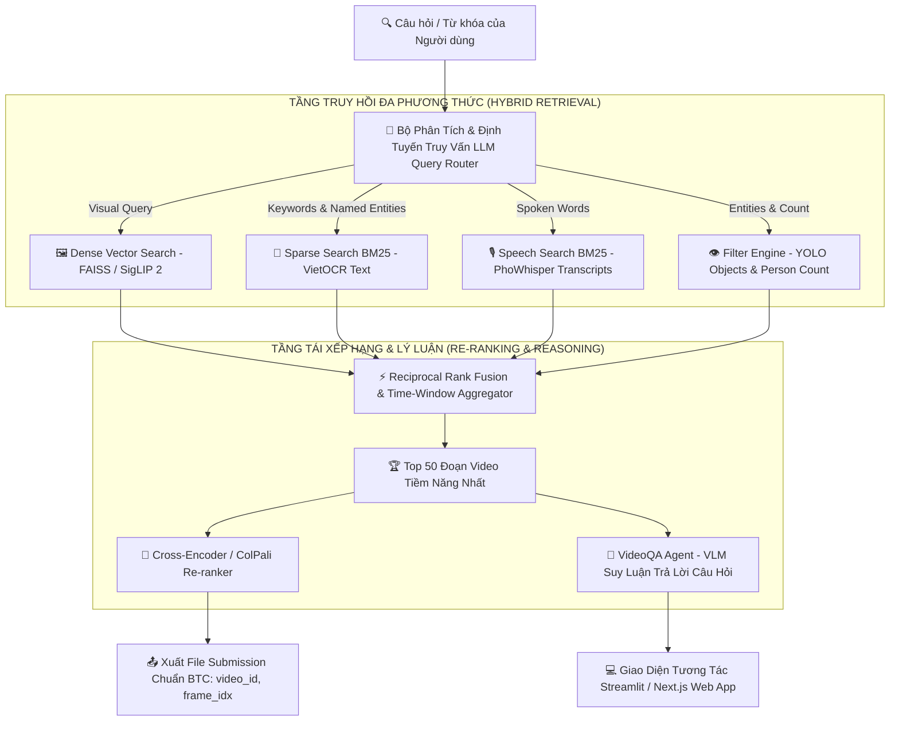

# 🚀 LỘ TRÌNH PHÁT TRIỂN HỆ THỐNG AIC2026 TRÊN NỀN TẢNG DỮ LIỆU ĐA PHƯƠNG THỨC 360°

> **Mục tiêu:** Tận dụng 100% kho dữ liệu đa phương thức hoàn chỉnh (*177.321 Keyframes + VietOCR tiếng Việt + PhoWhisper Transcripts + YOLO Objects + CLIP Embeddings + Metadata Video*) để xây dựng **Hệ thống Tìm kiếm Video & Hỏi Đáp Video (KIS & VideoQA) Đạt Top 1 Bảng Xếp Hạng**.

---

## 🏛️ TỔNG QUAN KIẾN TRÚC HỆ THỐNG SẼ PHÁT TRIỂN

---

## 🛠️ CHI TIẾT 4 PHÂN HỆ CHÍNH CẦN PHÁT TRIỂN

---

### 1️⃣ Phân hệ 1: Bộ Chỉ Mục Tìm Kiếm Lai Hợp Nhất (Hybrid Multi-Modal Indexing)
* **Xây dựng Inverted Index (BM25) nâng cao:**
  * Đánh chỉ mục toàn văn tiếng Việt cho: `OCR Banners + Audio Transcripts + Video Metadata (Title, Description, Keywords)`.
  * Áp dụng từ điển đồng nghĩa (Synonyms Expansion) chuyên biệt cho địa danh Việt Nam, từ viết tắt thời sự (ĐBSCL, TP.HCM, UBND, BOT, CSGT...).
* **Xây dựng Dense Vector Index (FAISS GPU / HNSW):**
  * Lưu trữ vector đặc trưng thị giác của toàn bộ 177.321 frames.
  * Hỗ trợ tìm kiếm theo hình ảnh tương đồng (Image-to-Video Search) và văn bản miêu tả cảnh (Text-to-Video Search).
* **Bộ lọc thuộc tính có cấu trúc (Structured Filters):**
  * Lọc theo khoảng thời gian phát sóng, kênh truyền hình, số lượng người xuất hiện trong khung hình.

---

### 2️⃣ Phân hệ 2: Thuật Toán Dung Hợp & Gom Cụm Thời Gian (Rank Fusion & Temporal Windowing)
* **Reciprocal Rank Fusion (RRF):**
  * Kết hợp điểm số từ cả 4 luồng: $Score = \alpha \cdot Score_{CLIP} + \beta \cdot Score_{OCR} + \gamma \cdot Score_{ASR} + \delta \cdot Score_{Metadata}$.
* **Gom cụm thời gian theo cảnh quay (Temporal Window Aggregation):**
  * Khi phát thanh viên nói một câu dài 15 giây, hoặc một sự việc diễn ra qua nhiều góc quay, hệ thống tự động gom các keyframe liên tiếp thành **đoạn video (Scene Segment)**, cộng dồn điểm tin cậy để đẩy đoạn video đó lên Top 1 thay vì chỉ trả về 1 frame rời rạc.

---

### 3️⃣ Phân hệ 3: AI Hỏi Đáp Video (VideoQA & Event Reasoning Agent)
* **Phục vụ các câu hỏi phức tạp:**
  * *Ví dụ: "Chiếc xe cứu thương xuất hiện ở phút thứ mấy và sau đó sự kiện gì xảy ra?"*
  * *Ví dụ: "Tìm đoạn video phát biểu về sạt lở tại Cần Thơ và cho biết con số thiệt hại được nhắc tới là bao nhiêu?"*
* **Cơ chế hoạt động:**
  * Agent truy xuất các Keyframe + Đoạn hội thoại ASR tương ứng.
  * Đưa toàn bộ ngữ cảnh (Hình ảnh + Chữ trên màn hình + Lời nói) vào mô hình Vision-Language (VLM) để sinh câu trả lời chính xác kèm dẫn chứng mốc giây/khung hình.

---

### 4️⃣ Phân hệ 4: Giao Diện Điều Khiển & Xuất Báo Cáo Thi Đấu (Streamlit / Web App)
* **Giao diện tìm kiếm thời gian thực (Interactive GUI):**
  * Thanh tìm kiếm thông minh tự động nhận diện ý định (tìm theo chữ, theo giọng nói hay theo cảnh quan).
  * Trình phát video (Video Player) với tính năng nhảy ngay tới đúng giây (Seek to Timestamp) của Keyframe tìm thấy.
  * Bảng hiển thị thông tin 360° bên cạnh video: Lời thoại đang nói, chữ trên màn hình, vật thể nhận diện.
* **Bộ xuất kết quả tự động (Auto Submission Generator):**
  * Một cú click chuột tạo ngay file CSV/Parquet định dạng chuẩn theo đúng quy định của BTC AIC2026: `<video_id>,<frame_idx>`.

---

## 📅 LỘ TRÌNH TRIỂN KHAI THEO TỪNG GIAI ĐOẠN

| Giai đoạn | Nội dung công việc | Đầu ra (Deliverable) |
| :--- | :--- | :--- |
| **Giai đoạn 1** *(Hiện tại)* | Hoàn tất 100% việc trích xuất OCR & PhoWhisper trên A100. | `ocr_results.parquet` (14 gói) & `transcripts.parquet` |
| **Giai đoạn 2** | Xây dựng Bộ chỉ mục lai BM25 + FAISS và thuật toán RRF. | Module `src/search/hybrid_search.py` |
| **Giai đoạn 3** | Tích hợp Temporal Aggregator & Re-ranker tối ưu Top 1 KIS. | Module `src/search/reranker.py` & Benchmark Evaluator |
| **Giai đoạn 4** | Xây dựng Agent VideoQA & Nâng cấp Giao diện Web Streamlit. | `app/app.py` hoàn chỉnh phục vụ thi đấu trực tiếp |
| **Giai đoạn 5** | Mock Test toàn diện với bộ câu hỏi KIS và QA của các năm trước. | Báo cáo đánh giá mAP@K, Top-1 Accuracy & Submission Check |
