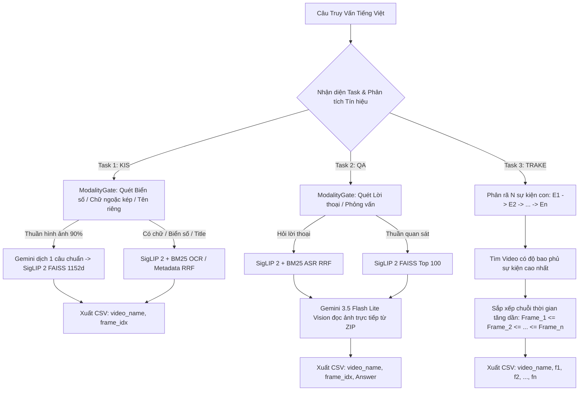

# 📑 TÀI LIỆU TỔNG QUAN HỆ THỐNG TRUY VẤN VIDEO AIC 2026
> **Mục đích tài liệu:** Cung cấp thông tin đầy đủ về Thể lệ cuộc thi, Toàn bộ Dữ liệu Đa phương thức hiện có, và Kiến trúc Pipeline hiện tại để tìm kiếm, tiếp nhận các đề xuất kỹ thuật nâng cao và giải pháp đột phá mới.
> **Thời gian cập nhật:** `2026-08-17`

---

## 🏆 PHẦN 1: THỂ LỆ & YÊU CẦU CÁC DẠNG BÀI THI (AIC 2026)

Cuộc thi Tìm kiếm Video Thông minh (AIC 2026 - Vòng Sơ tuyển) bao gồm **3 dạng truy vấn chính**:

### 1. Dạng 1: Textual Known Item Search (Textual KIS)
* **Yêu cầu:** Cho một đoạn mô tả chi tiết bằng tiếng Việt về một hành động, sự vật hoặc bối cảnh thị giác. Hệ thống cần tìm đúng video và khung hình chứa sự việc đó.
* **Định dạng kết quả nộp (CSV, Không Header, Tối đa 100 dòng):**
  ```text
  <video_name>, <frame_idx>
  ```
  *Ví dụ:* `L26_V355, 4662`

### 2. Dạng 2: Visual Question Answering (Visual Q&A)
* **Yêu cầu:** Cho một câu hỏi dạng vấn đáp tiếng Việt về chi tiết trong video (Ví dụ: *"Khi người đàn ông chạy xe, người ngồi sau đội gì trên đầu?"* hoặc *"Trong cuộc trò chuyện, người chủ vườn trả lời lúc mấy giờ bắt đầu làm việc?"*).
* **Định dạng kết quả nộp (CSV, Không Header, Tối đa 100 dòng):**
  ```text
  <video_name>, <frame_idx>, "<answer>"
  ```
  * *Quy định Answer:* Tối đa 100 ký tự, ngắn gọn (1-5 từ), bọc trong dấu ngoặc kép đôi `"..."`.
  * *Ví dụ:* `L27_V002, 920, "Mũ bảo hiểm"`

### 3. Dạng 3: Temporal Retrieval and Alignment of Key Events (TRAKE)
* **Yêu cầu:** Cho một mô tả gồm chuỗi $N$ sự kiện con diễn ra theo trình tự thời gian (Ví dụ: *"Đầu bếp xắt hành tây, sau đó cho thịt bò băm, tiếp tục cho đậu hà lan và cuối cùng cho nui vào chảo"*).
* **Định dạng kết quả nộp (CSV, Không Header, Tối đa 100 dòng):**
  ```text
  <video_name>, <frame_1>, <frame_2>, ..., <frame_N>
  ```
  * *Quy định bắt buộc:* Số lượng frame ID phải đúng bằng $N$ sự kiện và **bắt buộc phải xếp theo thứ tự thời gian tăng dần** ($frame_1 \le frame_2 \le \dots \le frame_N$).
  * *Ví dụ ($N=5$):* `L22_V006, 1200, 1850, 2100, 2450, 32918`

---

### 📊 4. Công Thức Tính Điểm Chính Thức Của Ban Tổ Chức (BTC)

Hệ thống tính điểm dựa trên **Top-$k$ Recall Score ($R@k$)** tại các mốc $k \in \{1, 5, 20, 50, 100\}$:

$$\text{Query Score} = \frac{R@1 + R@5 + R@20 + R@50 + R@100}{5}$$

> [!IMPORTANT]
> **Quy luật ăn điểm:**
> * Nếu video mục tiêu trúng ngay **Rank #1** $\implies R@1=1, R@5=1, R@20=1, R@50=1, R@100=1 \implies \mathbf{1.0000}$ (**Ăn trọn 100% điểm tuyệt đối**).
> * Nếu trượt xuống **Rank #2 đến #5** $\implies R@1=0, R@5=1 \dots \implies \mathbf{0.8000}$ (Mất 20% điểm).
> * Nếu trượt xuống **Rank #6 đến #20** $\implies \mathbf{0.6000}$.
> * Vì vậy, **tối ưu hóa độ chính xác tại Rank #1 ($R@1$)** là mục tiêu sống còn!

---

## 📦 PHẦN 2: TOÀN BỘ CƠ SỞ DỮ LIỆU ĐA PHƯƠNG THỨC ĐANG SỞ HỮU

Hệ thống sở hữu kho dữ liệu đa phương thức đồ sộ sẵn có ở thư mục `data/batch_1/processed/`:

| STT | Thành phần Dữ liệu | Quy mô & Chi tiết Cột Dữ Liệu | Định dạng & Vị trí Lưu Trữ |
| :---: | :--- | :--- | :--- |
| **1** | **Keyframe Images (Hình ảnh)** | **177,605 ảnh JPEG** chất lượng cao từ 873 video. | 14 File ZIP (`raw/batch_1/Keyframes/Keyframes_L*.zip`). Đọc RAM trực tiếp <5ms. |
| **2** | **Google SigLIP 2 Embeddings (SOTA)** | **177,605 vectors (1152 chiều)**. Mô hình `google/siglip2-so400m-patch14-384`. Cosine Normalized. | `data/batch_1/processed/siglip_features.npy` (408MB)<br>`indexes/batch_1/siglip2.faiss` (IndexFlatIP) |
| **3** | **BTC CLIP Embeddings** | **177,605 vectors (512 chiều)**. Mô hình `openai/clip-vit-base-patch32`. | `data/batch_1/processed/clip_features.npy` (181MB)<br>`indexes/batch_1/clip_btc.faiss` |
| **4** | **Video Metadata (Siêu dữ liệu Video)** | **873 videos**. Bao gồm: `video_id`, `author`, `title` (tiêu đề), `description` (mô tả), `keywords` (tags từ khóa), `length`, `publish_date`, `search_text`. | `data/batch_1/processed/videos.parquet`<br>`data/batch_1/processed/videos_raw.parquet` |
| **5** | **Object Detection & Entities (Vật thể)** | **177,321 frames** tóm tắt vật thể (`person_count`, `top_entities`, `high_conf_entities`) + **Hàng triệu Bounding Boxes** chi tiết (`class_name`, `entity`, `score`, `bbox_0..3`). | `data/batch_1/processed/object_summary.parquet`<br>`data/batch_1/processed/objects/L21..L30.parquet` |
| **6** | **OCR Text (Chữ trên khung hình)** | **177,605 bản ghi** trích xuất chữ từ VietOCR / PaddleOCR kèm `video_id`, `frame_idx`, `pts_time`, `ocr_text`. | `data/batch_1/processed/ocr_results.parquet`<br>`indexes/batch_1/bm25_ocr.pkl` (BM25 Index) |
| **7** | **ASR Transcripts (Lời thoại)** | **16,698 đoạn lời thoại** trích xuất từ PhoWhisper kèm `start_time`, `end_time`, `start_frame`, `end_frame`, `transcript`. | `data/batch_1/processed/transcripts.parquet`<br>`indexes/batch_1/bm25_asr.pkl` (BM25 Index) |
| **8** | **Frame Mapping & Temporal Ranges** | **177,321 frames** mapping `global_id, video_id, keyframe_index, pts_time, fps, frame_idx, position_ratio` + 873 video temporal ranges. | `data/batch_1/processed/frames.parquet`<br>`data/batch_1/processed/video_ranges.parquet` |
| **9** | **Benchmark Ground Truth** | **11 Test Cases** chuẩn hóa 100% format BTC (7 KIS, 2 QA, 2 TRAKE kèm khoảng timestamp đúng). | `data/benchmark/ground_truth.json` |

---

## ⚡ PHẦN 3: KIẾN TRÚC PIPELINE TỐT NHẤT HIỆN TẠI (CONFIG 11)

### 🥇 Thành tích kiểm chuẩn (Ablation Benchmark Matrix):
* **🏆 BTC Final Score:** **`0.6000`** (Tăng **+32.00%** so với Baseline CLIP của BTC là `0.2800`).
* **Độ trễ trung bình:** ~2s - 6s / truy vấn.



### 🔑 Các Module cốt lõi:
1. **Bộ Phân Loại Kích Hoạt Đa Kênh ([`ModalityGate`](file:///d:/HCMUS/AIC2026/src/query/modality_gate.py)):**
   * Giải quyết triệt để lỗi "BM25 gây nhiễu": Nếu câu hỏi thuần thị giác $\rightarrow$ Khóa 100% BM25 ($W=0$) để SigLIP 2 phát huy tối đa độ nhạy vector. Chỉ mở BM25 khi có biển số xe, tên quán, dòng chữ trong ngoặc kép hoặc lời phỏng vấn.
2. **Keyframe In-Memory ZIP Streaming ([`KeyframeZipLoader`](file:///d:/HCMUS/AIC2026/src/retrieval/keyframe_loader.py)):**
   * Đọc trực tiếp file ảnh JPEG từ 14 file ZIP vào RAM trong <5ms, không cần giải nén 30GB ra ổ cứng.
3. **Visual QA Agent ([`VisualQAAgent`](file:///d:/HCMUS/AIC2026/src/tasks/qa_agent.py)):**
   * Tích hợp Gemini 3.5 Flash Lite Vision để nhìn vào ảnh các khung hình hàng đầu và suy luận ra đáp án ngắn gọn (1-5 từ).
4. **TRAKE Sequential Alignment Agent ([`TRAKEAlignmentAgent`](file:///d:/HCMUS/AIC2026/src/tasks/trake_agent.py)):**
   * Đảm bảo mọi dòng dự đoán của TRAKE luôn tuân thủ nghiêm ngặt tính đơn điệu của thời gian ($f_1 \le f_2 \le \dots \le f_n$).
5. **Gemini Key Pool ([`GeminiKeyPool`](file:///d:/HCMUS/AIC2026/src/query/gemini_router.py)):**
   * Tự động xoay vòng 3 API Keys, đảm bảo không bao giờ bị nghẽn rate limit (429).

---

## 🎯 PHẦN 4: CÁC THÁCH THỨC CẦN TÌM KIẾM GIẢI PHÁP & ĐỀ XUẤT ĐỘT PHÁ

Hiện tại hệ thống đã đạt mốc cơ sở vững chắc **0.6000**. Chúng tôi mong muốn tìm kiếm và tiếp nhận mọi **ý tưởng, kỹ thuật, mô hình hoặc kiến trúc mới (SOTA)** để giải quyết các nút thắt sau:

1. **Thách thức đẩy kết quả lên Rank #1 ($R@1$ Bottleneck):**
   * Nhiều video đúng hiện đang nằm ở vị trí Rank #2 đến #7 (làm mất 20% - 40% điểm của câu). Cần các kỹ thuật Re-ranking, Cross-Attention, hoặc Filter thông minh để đẩy chính xác video mục tiêu lên vị trí #1.
2. **Khai thác tối ưu kho dữ liệu đa phương thức đồ sộ (Multi-modal Fusion):**
   * Chúng tôi đang có sẵn: **177k ảnh**, **177k embedding SigLIP 2**, **hàng triệu Bounding Boxes & Danh sách vật thể**, **873 Video Metadata (title, desc, tags)**, **177k OCR**, **16k ASR**.
   * Đề xuất phương pháp kết hợp / dung hợp (Fusion) hiệu quả giữa các nguồn này mà không làm triệt tiêu hay gây nhiễu lẫn nhau.
3. **Bài toán chuỗi sự kiện thời gian (TRAKE Optimization):**
   * Tìm kiếm các thuật toán hoặc kiến trúc chuyên biệt cho việc phát hiện và gióng hàng (alignment) chuỗi $N$ hành động liên tiếp diễn ra trong video.
4. **Hiểu câu truy vấn & Chuyển đổi ngôn ngữ (Query Understanding & Cross-lingual Retrieval):**
   * Đề xuất phương pháp phân tích câu hỏi tiếng Việt, trích xuất thực thể, mở rộng truy vấn (Query Expansion) hoặc sinh prompt tối ưu nhất cho không gian biểu diễn thị giác.
5. **Mọi ý tưởng / Kỹ thuật nâng cao khác:**
   * Hoàn toàn hoan nghênh mọi đề xuất mới về: Mô hình VLM / Video-LLM, Multi-vector / Late-interaction retrieval, Dynamic Prompting, Graph-based Retrieval, hoặc các chiến thuật thi đấu đã từng chứng minh hiệu quả cao ở các cuộc thi tương tự.

---
*Tài liệu này được xuất bản tự động từ hệ thống AIC 2026 Codebase.*
